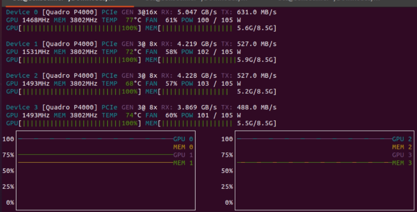
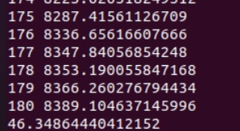

# Crowd Counting

This project is about crowd counting and it is also an implementaion of the [CSRNet: Dilated Convolutional Neural Networks for Understanding the Highly Congested Scenes](https://arxiv.org/abs/1802.10062) on our private dataset using Pytorch backend with the help of the author's github (https://github.com/leeyeehoo/CSRNet-pytorch).

The previous work on this model has lack of some utility, e.g., there isn't any use of DataParallel or DistributedDataParallel  
to use multiple gpus.  
So in this repository we added the missing utility to speed the training process, and to improve the accuracy of the model.  

## Contributors
[Kamel Gerado](https://github.com/kamel402), [Taif Alwafi](https://github.com/TaifAlwafi), [Arwa Komo](https://github.com/arwamk), [Azzam Alturkistani](https://github.com/azamasim), Reem Alruqi, Waad Alruqi, Sundus Bin siddiq, Amjad Alotaibi.


  

------

## Prerequisites
We use Anaconda as the package manager with these versions of packages, and we recommend to do so.

Python: 3.8

PyTorch: 1.9.0

CUDA: 10.2

You can build the Anaconda environment by running the following commands:
```
conda create -n CSRNet python=3.8
conda activate CSRNet
conda install pytorch torchvision torchaudio cudatoolkit=10.2 -c pytorch
```

## Datasets
We used private Dataset that we can't share, but you can use ShanghaiTech Dataset, and we split our data into: 70% for training, and 15% for each validation and testing.

## Data Augmentation
The paper suggest to use data augmentation, but in author's version there isn't any implementation of the data augmentation, so we decide to use it in this repostory.  
The Dataset contains not only the images, but also mat files, in this case we can't use the built-in function `transforms` in Pytorch, because it only applied on images not the mat files.  
Run `data_augmentation.ipynb` to increase the Dataset. This will mirror the images and associated mat files, and then crop each images and associated mat files into 9 patches.

## Ground Truth
Run `make_dataset.ipynb` to generate the ground truth of your data. This will not take too much time unlike the author's version.

## Training Process
#### 1. Generate json file
Before you train your model, you need to generate json files for training and validation sets  
run `generate_json_file.ipynb` to generate json files.  
#### 2. Train  
You have two option, either you train your model on a single gpu or multiple gpu.  
- __Train on a single gpu:__  
Run `python train.py train.json val.json -gpu 0` to start training on a single gpu, the first two argument are the jsons file  
the third is the id of the gpu, the default is 0.

- __Train on multiple gpu:__  
Training on single gpu can take too much time to reach a good result, so to speed the training process we modified  
`train.py` file to use DistrubtedDataParallel.  
Run `python train_ddp.py train.json val.json -gpus 4` to start training on multiple gpu, the first two arguments are the same    
but third is the number of gpus you want to use, the default is 2.
  

## Testing

Run `test.ipynb` or `test.py` to test the model.  
The average absolute error we obtained on test data is 46.34864440412152.



## Results
After we trained the model on our private Dataset, the best MAE is 42.2.


